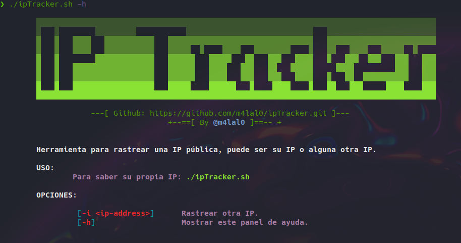

# IP-Tracker
[](#)
[](#)
[](#)
[](#)



Herramienta hecha en Bash para rastrear una IP pública, puede ser su propia IP o alguna otra dirección IP.

## Instalación & Uso
Para descargar la herramienta:
```sh
git clone https://github.com/m4lal0/ipTracker
cd ipTracker; chmod +x ipTracker.sh
```

Ejecute la herramienta sin opciones para obtener datos de su propia IP pública
```sh
./ipTracker.sh
```

## Rastrear otra IP
Para rastrear la información de otra dirección IP, usamos la opción **-i**:
```sh
./ipTracker.sh -i <IP-Address>
```

>La información mostrada por la herramienta son: IP, Pais, Ciudad, Region, Latitud, Longitud e ISP.