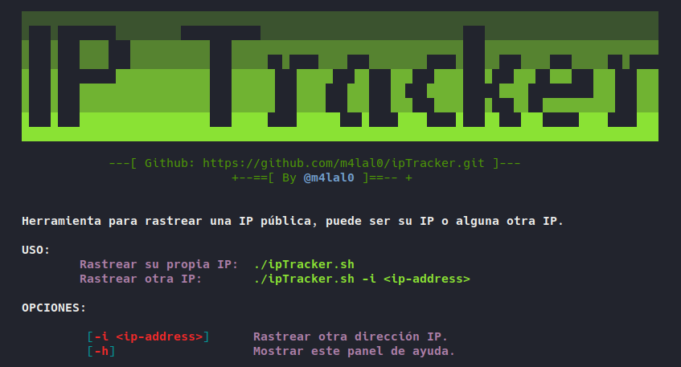

# IP-Tracker
Herramienta ideal hecha en Bash para rastrear una IP pública, puede ser su IP o alguna otra IP.

## Uso
Para ejecutar la herramienta colocamos lo siguiente:
```bash
git clone https://github.com/m4lal0/ipTracker
cd ipTracker
chmod +x ipTracker.sh
./ipTracker.sh
```

## Panel de ayuda
Si queremos ver el panel de ayuda solo ejecutamos lo siguiente:
```bash
./ipTracker.sh -h
```

<p align="center">

</p>

## Rastrear otra IP
Para rastrear la información de otra IP, colocamos lo siguiente:
```bash
./ipTracker.sh -i <IP-address>
```

>La información mostrada por la herramienta son: IP, Pais, Ciudad, Region, Latitud, Longitud e ISP.